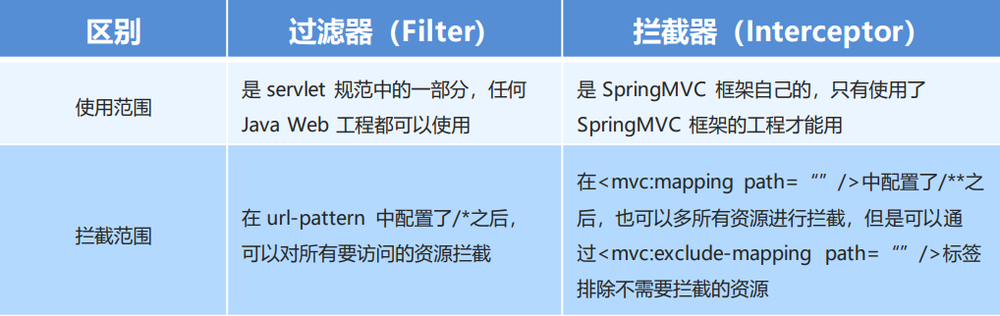

## springMVC的拦截器

#### 1、拦截器(Interceptor)的作用

SpringMVC的拦截器类似于Servlet开发中的过滤器Filter，用于对处理器进行预处理和后处理。

将拦截器按一定的顺序联结成一条链，这条链称为拦截器链(Interceptor Chain)。在访问拦截的方法或字段时，拦截器链中的拦截器就会按其定义的顺序被调用。拦截器也是AOP思想的具体实现。

#### 2、拦截器和过滤器的区别



#### 3、拦截器是快速入门

自定义拦截器很简单，只有如下三步： 

① 创建拦截器类实现HandlerInterceptor接口 

```java
public class MyHandlerInterceptor1 implements HandlerInterceptor {
    public boolean preHandle(HttpServletRequest request, HttpServletResponse 
    	response, Object handler) {
        System.out.println("preHandle running...");
        return true;
    }
    public void postHandle(HttpServletRequest request, HttpServletResponse 
    	response, Object handler, ModelAndView modelAndView) {
        System.out.println("postHandle running...");
    }
    public void afterCompletion(HttpServletRequest request, HttpServletResponse 
    	response, Object handler, Exception ex) {
    	System.out.println("afterCompletion running...");
    }
}

```

② 配置拦截器 

```xml
<!--配置拦截器-->
<mvc:interceptors>
    <mvc:interceptor>
    	<mvc:mapping path="/**"/>
    	<bean class="com.itheima.interceptor.MyHandlerInterceptor1"/>
    </mvc:interceptor>
</mvc:interceptors>
```

③ 测试拦截器的拦截效果（编写目标方法）

```java
@RequestMapping("/quick23")
@ResponseBody
public ModelAndView quickMethod23() throws IOException, ParseException {
    System.out.println("目标方法执行....");
    ModelAndView modelAndView = new ModelAndView();
    modelAndView.addObject("name","itcast");
    modelAndView.setViewName("index");
    return modelAndView;
}
```

